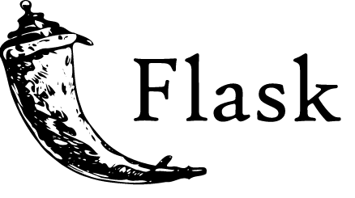

# 👋 I'm Niroshian B | Full-Stack Web Developer 👨‍💻

## 🛠️ Currently Practicing Technologies Include:

    
    
    
    
    
    
    
    

## 💭 Previously Used:

    
    
    
    
    

## 🔭 I’m currently working on:
    
    - Learning more advanced techniques using Python and Django Rest Framework to build Web APIs
    
## 📫 How to reach me:

<a href = "mailto: niroshian.b@gmail.com">Email</a> | [LinkedIn](http://www.linkedin.com/in/niro-b)

<!--
**niroshian-b/niroshian-b** is a ✨ _special_ ✨ repository because its `README.md` (this file) appears on your GitHub profile.

Here are some ideas to get you started:

-   💬 Ask me about ...
-
-   😄 Pronouns: ...
    -->
